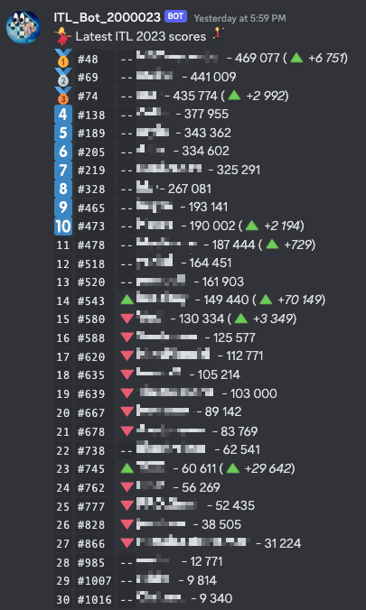

# itl-bot
Bot for posting [ITL 2023 Online](https://itl2023.groovestats.com/) scores to Discord via webhook



Bot runs in [CloudFlare Workers](https://workers.cloudflare.com/) and stores previous scores in [CloudFlare KV](https://www.cloudflare.com/products/workers-kv/)

## Deploying

1. Create a Discord Webhook on the channel you want to add the bot to. You can follow for example [this guide](https://support.discord.com/hc/en-us/articles/228383668-Intro-to-Webhooks) until you get the webhook url
1. Create CloudFlare account at https://dash.cloudflare.com/
1. Open Workers -> KV and `Create a namespace`
1. Copy `wrangler.example.toml` to `wrangler.toml`
1. Edit `wrangler.toml` to name your app, add KV id, list your players, create api key if needed and add Discord Webhook URL
1. `$ npm install`
1. `$ npm deploy-dev` to deploy to CloudFlare Workers
1. If all went fine, the bot should start posting scores to Discord at designated time

## Triggering scoreboard on demand through API

If you set API key in wrangler.toml, you can trigger the score board on demand. If unset, on demand triggering is not possible. To trigger the process, simply call your worker's url with header `"authentication": your-api-key-here`

Calling development server:
```
$ curl --request GET \
  --url http://localhost:8787/ \
  --header 'authentication: your-api-key-here'
```

Calling production server:
```
curl --request GET \
  --url http://production.your-itl-bot.workers.dev/ \
  --header 'authentication: your-api-key-here'
```

## Development

1. You can create multiple environments in wrangler.toml if preferred, by default only dev environment is created
1. Setup API key in wrangler.toml
1. Launch dev server at CloudFlare with `$ npm start`
1. To trigger posting scores, trigger scoreboard through API as described above